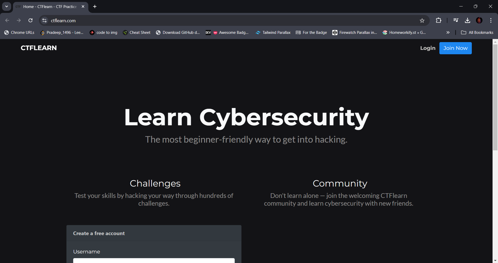

# Simple Web Extension to edit text 

A simple way of edit text without enable developer mode and inspect element on browser

## Authors

- [@Pradeep-1496](https://github.com/Pradeep-1496)


## Works with:


## Screenshots

### Before Editing
 
 
 

---
### Enable the Extension 
 

  

---
### Edit Web 
 

  

---
### Disable Extension
 

  

---

## Installation


```bash
  git clone https://github.com/Pradeep-1496/WebEdit.git
  cd WebEdit
```

### Load in Browser

- In chrome Enable Developer mode in Extension management.
- Select Load unpacked option.
- Select the folder of WebEdit where you clone the repo.
- Pin the Extension (Web Edit)
- Enjoy the tool

---

## 🚀 About Me
- I'm Tech enthusiast that have knowledge of programming with Development 
- I love to develop reallife problem solution software or systems
- Also like to Contribute within open source also
- If you like my work then star my Repository to helpful for other too.


## License

[](https://choosealicense.com/licenses/mit/)
